# library-app

A small library-management REST API built to demonstrate **Spring Data JPA** and
**Spring Security** together on one consistent domain: authors, books, borrowers, and
loans. Java 21, Spring Boot 3.3.4, Maven, H2 (dev), Flyway, JWT auth.

See [`prompts.md`](prompts.md) for the original spec this was generated from, and
[`How_to_Run.md`](How_to_Run.md) for a use-case-by-use-case request/response walkthrough.

---

## 1. Domain model

```
Author   – id, name
Book     – id, title, isbn (unique), author (ManyToOne LAZY → Author)
Borrower – id, email (unique), password (BCrypt), role (MEMBER | LIBRARIAN)
Loan     – id, book (ManyToOne LAZY → Book), borrower (ManyToOne LAZY → Borrower),
           loanDate, dueDate, returned
```

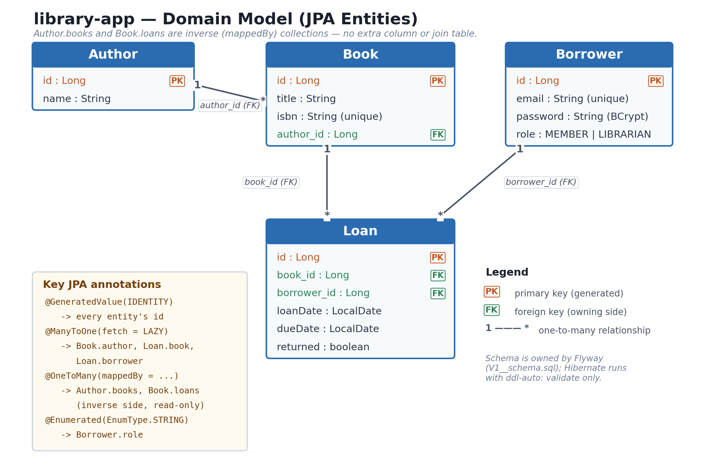

`Author 1—* Book` and `Book 1—* Loan` are both mapped as inverse (`mappedBy`)
collections — the foreign keys live only on `Book.author_id`, `Loan.book_id`, and
`Loan.borrower_id`. Schema is owned by Flyway; Hibernate runs with
`ddl-auto: validate` everywhere, never `update`/`create-drop`.

## 2. Project layout

```
src/main/java/com/library/
  LibraryApplication.java     application entry point
  config/
    SecurityConfig.java       SecurityFilterChain, PasswordEncoder, UserDetailsService, AuthenticationManager
    JwtConfig.java             @ConfigurationProperties("library.jwt"), fail-fast validated
    LibraryHealthIndicator.java custom actuator health detail (overdueLoans count)
    DataLoader.java            @Profile("!prod") — seeds one demo active loan at startup
  domain/                      Author, Book, Borrower, Role, Loan (JPA entities)
  repository/                  Spring Data interfaces — derived queries, JPQL, native SQL, @EntityGraph
  service/                     BookService, LoanService, AuthService, LoanException
  security/                    JwtService (issue/parse), JwtFilter, BorrowerPrincipal (UserDetails)
  web/                         BookController, LoanController, AuthController, GlobalExceptionHandler
  web/dto/                     one record per entity + request/response DTOs — entities never cross the boundary

src/main/resources/
  application.yml              dev profile: H2, show-sql, Hibernate statistics, DEBUG logging
  application-prod.yml         prod overrides: external DB, JSON log pattern
  db/migration/
    V1__schema.sql             Flyway baseline schema
    V2__seed_data.sql          3 authors, 3 books, 3 borrowers (BCrypt-hashed passwords)

src/test/java/com/library/
  repository/BookRepositoryTest.java   @DataJpaTest against real Flyway-migrated H2
  service/LoanServiceTest.java         plain Mockito unit test, no Spring context
  web/BookControllerTest.java          @WebMvcTest, BookService mocked
```

## 3. Architecture

Request flow through the layers, plus how the JWT auth path and the observability
components (actuator health, Micrometer, MDC logging) hook into that pipeline:

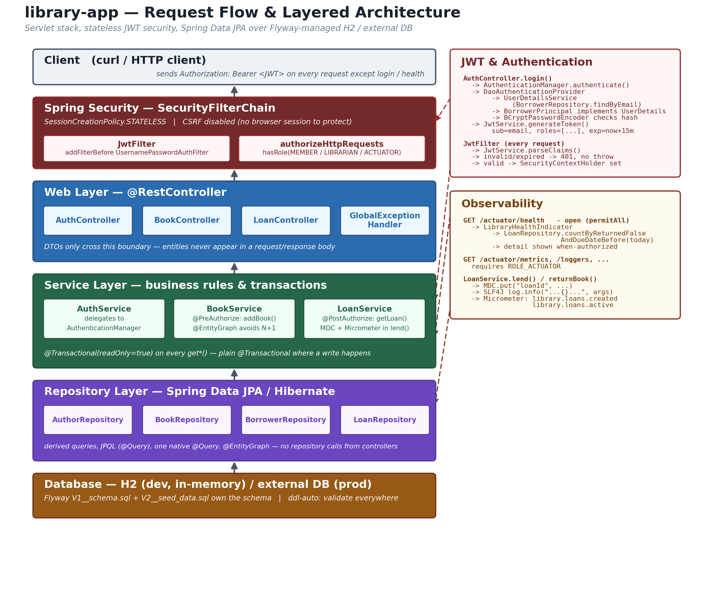

## 4. Day 3 (Spring Data JPA) concepts, illustrated

One diagram per concept — each one maps directly to the code cited in it.

**1. Spring Data JPA query methods** — derived queries, pagination, `Optional`:
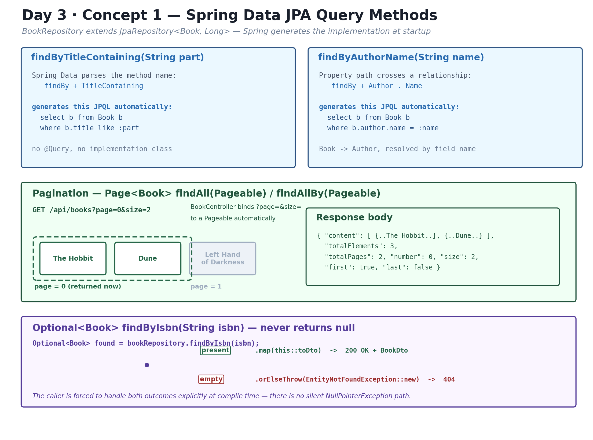

**2. Hibernate dirty checking** — how `renameBook()` persists without calling `save()`:
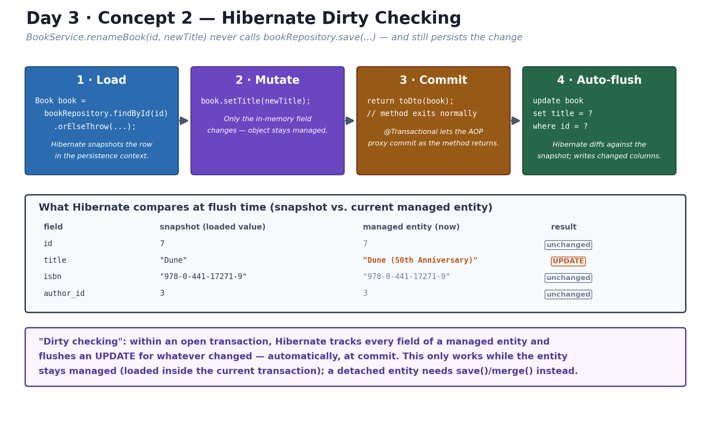

**3. Repository pattern** — the layered call chain and the four rules `LoanService.lend()` enforces:
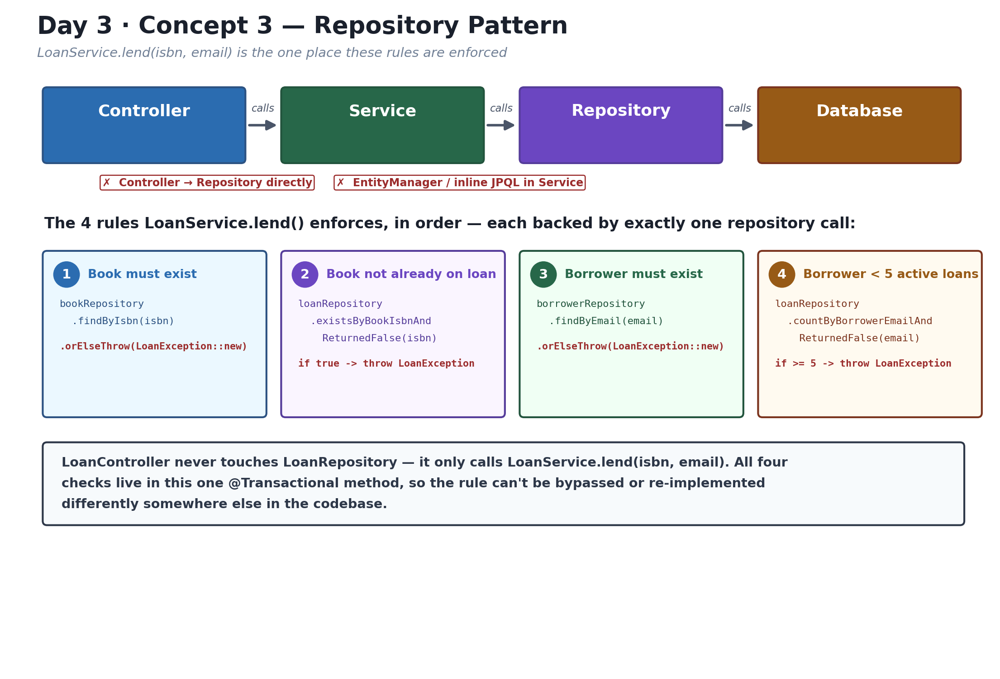

**4. JPQL vs. native query** — the same question answered two ways, side by side:
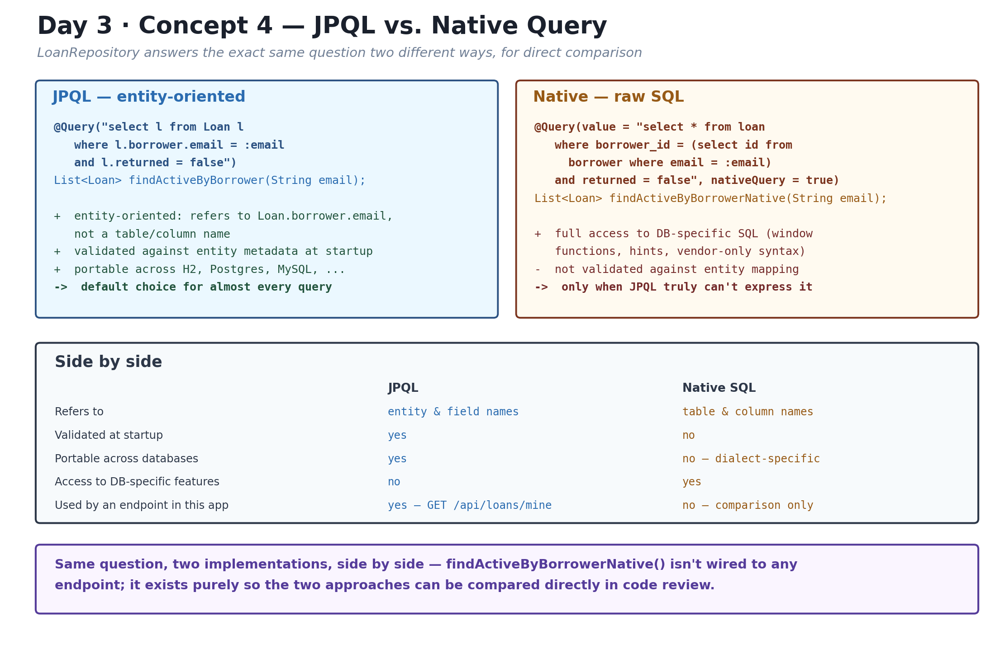

**5. Entity relationships & the N+1 problem** — what `@EntityGraph` actually fixes:
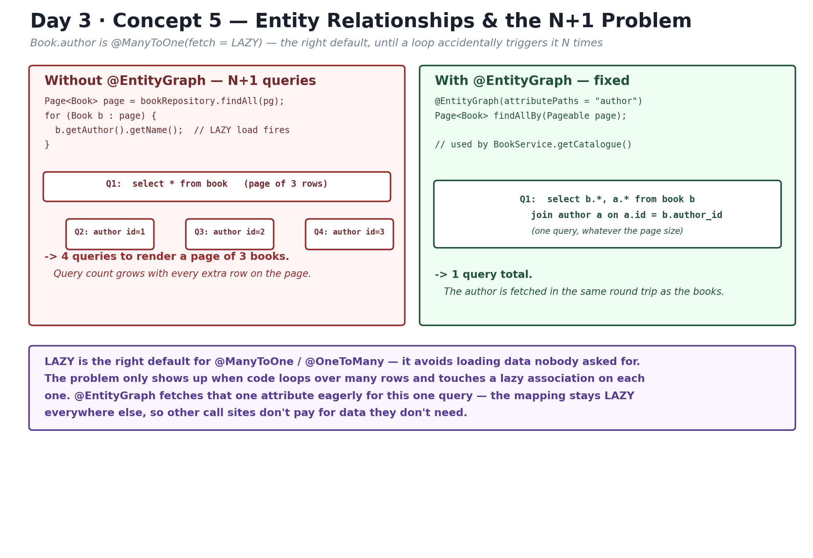

**6. Transaction management** — the three `@Transactional` shapes used here, and the self-invocation trap:
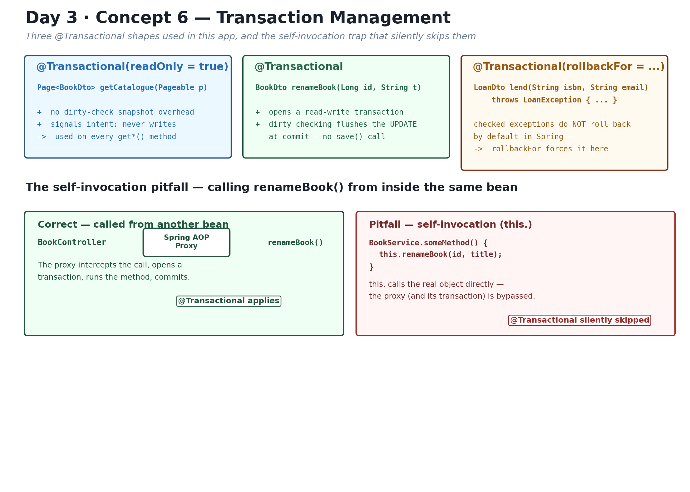

## 5. Day 4 (Spring Security) concepts, illustrated

**1. Spring Security filter chain** — stateless, CSRF disabled, and the ordered `authorizeHttpRequests` rules:
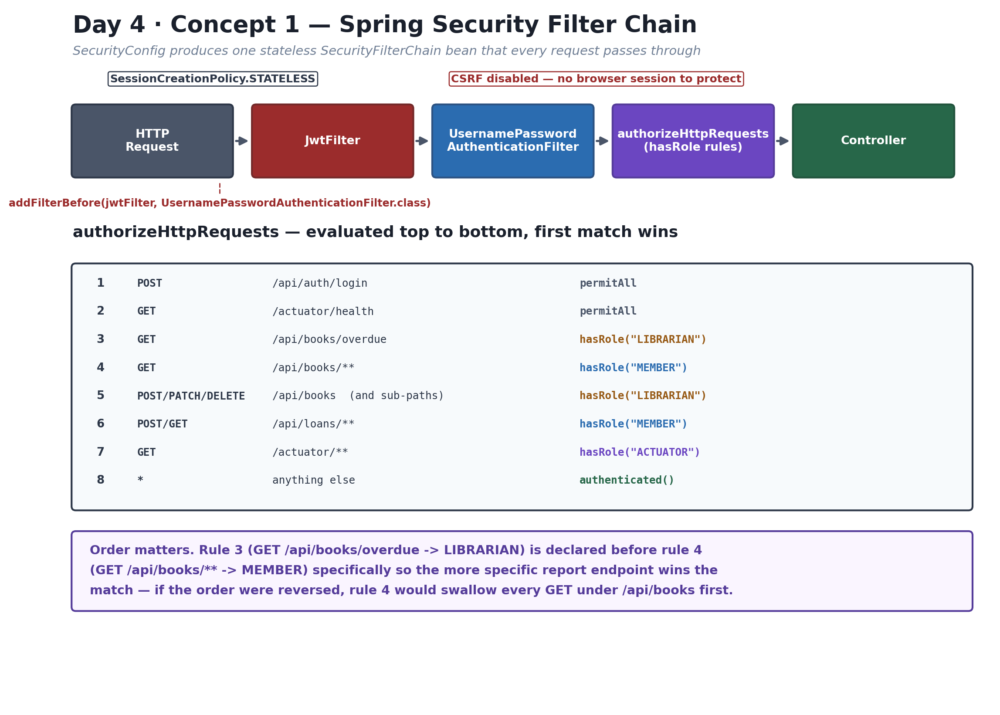

**2. Authentication & method security** — `BorrowerPrincipal`, and `@PreAuthorize` vs `@PostAuthorize`:
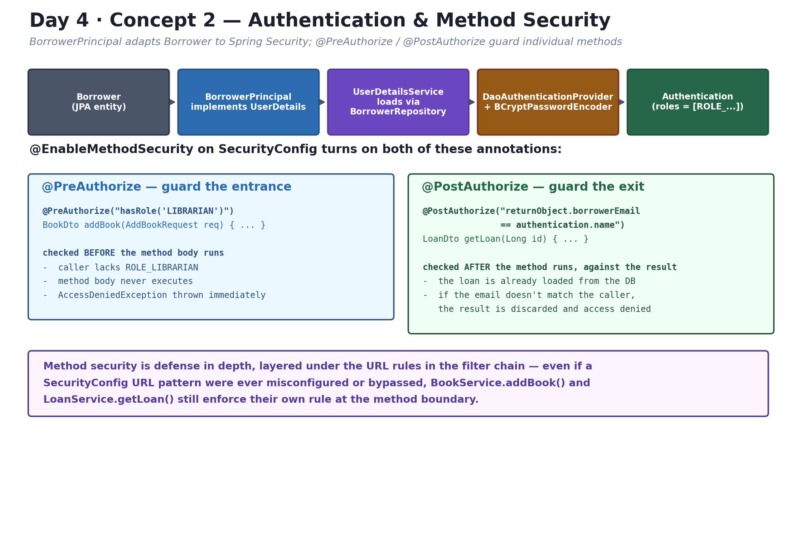

**3. JWT authentication** — token structure, issuance at login, validation on every request:
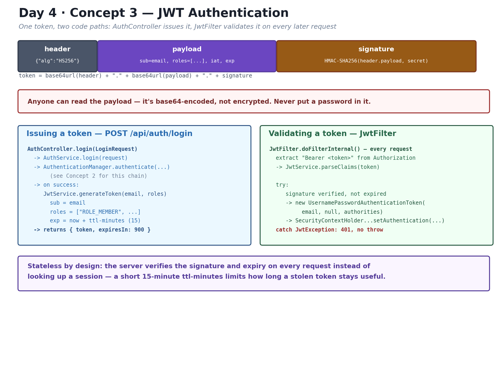

**4. Spring Boot Actuator** — exposed endpoints, role gating, and the custom health indicator:
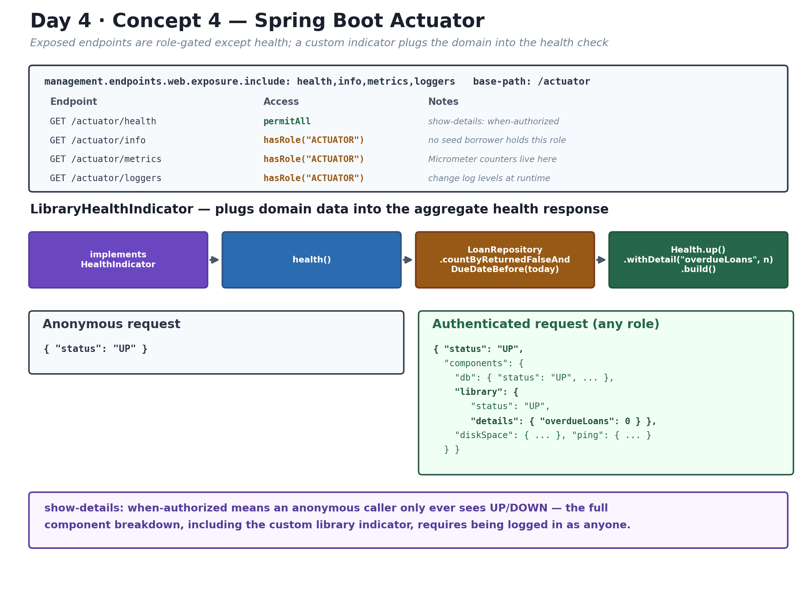

**5. Logging & monitoring** — MDC, SLF4J placeholders, and Micrometer counters:
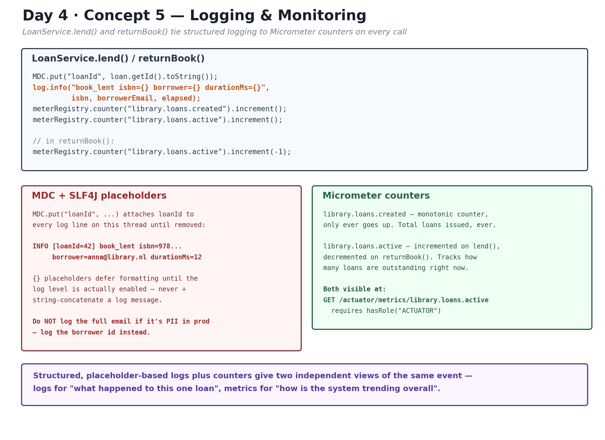

**6. Application profiles & configuration** — dev vs. prod, and fail-fast `@ConfigurationProperties`:
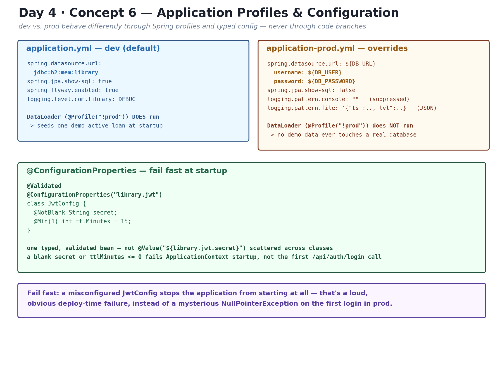

## 6. What each feature demonstrates

| Feature | Where |
|---|---|
| Derived queries (`findByTitleContaining`, `findByAuthorName`, `findByIsbn`) | `BookRepository` |
| Pagination | `BookRepository.findAll(Pageable)`, `BookController.getCatalogue` |
| JPQL vs. native query for the same question | `LoanRepository.findActiveByBorrower` / `findActiveByBorrowerNative` |
| `@EntityGraph` to avoid N+1 | `BookRepository.findAllBy`, used by `BookService.getCatalogue` |
| Dirty checking (no explicit `save()`) | `BookService.renameBook` |
| Transaction boundaries (`readOnly`, `rollbackFor`) | every `@Transactional` in `BookService`/`LoanService` |
| Repository-pattern business rules (book exists, not already on loan, <5 active loans) | `LoanService.lend` |
| JWT issuance / validation | `JwtService`, `AuthController`, `JwtFilter` |
| Stateless filter chain, method security | `SecurityConfig` |
| `@PreAuthorize` / `@PostAuthorize` | `BookService.addBook`, `LoanService.getLoan` |
| Custom actuator health detail | `LibraryHealthIndicator` |
| MDC + structured logging + Micrometer counters | `LoanService.lend` / `returnBook` |
| Profile-guarded seeding | `DataLoader` (`@Profile("!prod")`) |

## 7. Running it

Requires JDK 21. The Maven wrapper is included, so no local Maven install is needed.

```bash
# dev profile (default) — in-memory H2, Flyway auto-applies V1/V2 on startup
./mvnw spring-boot:run

# or build the jar and run it directly
./mvnw package -DskipTests
java -jar target/library-app-0.0.1-SNAPSHOT.jar
```

The app starts on **http://localhost:8080**. H2 is in-memory (`jdbc:h2:mem:library`) —
data resets on every restart, then gets reseeded by Flyway.

To run against the `prod` profile (expects a real database, reachable via env vars):

```bash
JWT_SECRET=some-32-plus-char-secret \
DB_URL=jdbc:postgresql://localhost:5432/library \
DB_USER=library DB_PASSWORD=secret \
java -jar target/library-app-0.0.1-SNAPSHOT.jar --spring.profiles.active=prod
```

### Running the tests

```bash
./mvnw test
```

`BookRepositoryTest` spins up a real embedded H2 instance with Flyway migrations
applied (not a mocked repository), `LoanServiceTest` is a pure Mockito unit test with
no Spring context, and `BookControllerTest` slices in only the web layer with
`BookService` mocked out.

## 8. Seed data / demo credentials

Loaded by `V2__seed_data.sql` on every dev/prod startup (passwords are BCrypt hashes,
not plaintext):

| Email | Password | Role |
|---|---|---|
| `anna@library.nl` | `member123` | MEMBER |
| `bob@library.nl` | `member123` | MEMBER |
| `admin@library.nl` | `admin123` | LIBRARIAN |

Books: *The Hobbit* (`978-0-261-10221-7`), *Dune* (`978-0-441-17271-9`),
*The Left Hand of Darkness* (`978-0-441-47812-5`).

`DataLoader` additionally creates one active loan (anna ← The Hobbit) on non-prod
startup so `GET /api/loans/mine` isn't empty out of the box.

## 9. Trying it with curl

```bash
# 1. Log in as a member, capture the JWT
TOKEN=$(curl -s -X POST http://localhost:8080/api/auth/login \
  -H "Content-Type: application/json" \
  -d '{"email":"anna@library.nl","password":"member123"}' | python3 -c "import sys,json;print(json.load(sys.stdin)['token'])")

# 2. Browse the catalogue (paginated)
curl -s http://localhost:8080/api/books -H "Authorization: Bearer $TOKEN"

# 3. Borrow a book
curl -s -X POST http://localhost:8080/api/loans \
  -H "Authorization: Bearer $TOKEN" -H "Content-Type: application/json" \
  -d '{"isbn":"978-0-441-17271-9"}'

# 4. See your active loans
curl -s http://localhost:8080/api/loans/mine -H "Authorization: Bearer $TOKEN"

# 5. Health check (no auth required, extra detail if authenticated)
curl -s http://localhost:8080/actuator/health
```

Log in as `admin@library.nl` / `admin123` (role LIBRARIAN) to try `POST /api/books`,
`PATCH /api/books/{id}/title`, `DELETE /api/books/{id}`, and
`GET /api/books/overdue?author=`.

## 10. REST API

| Method | Path | Role | Notes |
|---|---|---|---|
| `POST` | `/api/auth/login` | open | Returns `{ token, expiresIn }` |
| `GET` | `/api/books` | MEMBER | Paginated catalogue |
| `GET` | `/api/books/{id}` | MEMBER | Single book |
| `GET` | `/api/books/search?title=` | MEMBER | Derived query |
| `GET` | `/api/books/overdue?author=` | LIBRARIAN | JPQL query |
| `POST` | `/api/books` | LIBRARIAN | Add a book |
| `PATCH` | `/api/books/{id}/title` | LIBRARIAN | Rename (dirty-check demo) |
| `DELETE` | `/api/books/{id}` | LIBRARIAN | Remove a book |
| `POST` | `/api/loans` | MEMBER | Lend a book to yourself |
| `POST` | `/api/loans/{id}/return` | MEMBER | Return a book |
| `GET` | `/api/loans/{id}` | MEMBER | Single loan (only your own — `@PostAuthorize`) |
| `GET` | `/api/loans/mine` | MEMBER | Your active loans |
| `GET` | `/actuator/health` | open | `overdueLoans` detail shown when authenticated |
| `GET` | `/actuator/metrics`, `/loggers`, etc. | ACTUATOR | No seed user holds this role by default |

`MEMBER` and `LIBRARIAN` are mutually exclusive roles on `Borrower.role` — the seeded
librarian account cannot read `/api/books/**` (MEMBER-only), matching the role rules
above exactly.

## 11. Notable design decisions

- **Flyway + H2**: Spring Boot 3.3.x's Flyway 10 BOM does not publish a separate
  `flyway-database-h2` artifact — H2 support ships inside `flyway-core` itself, so
  `pom.xml` depends on `flyway-core` only.
- **Seed data ownership**: `V2__seed_data.sql` is the single source of authors,
  books, and borrowers (with real BCrypt hashes). `DataLoader` doesn't duplicate that
  — it's a `@Profile("!prod")`-guarded runner that only adds one demo loan, so it
  can't collide with the unique constraints Flyway already seeded.
